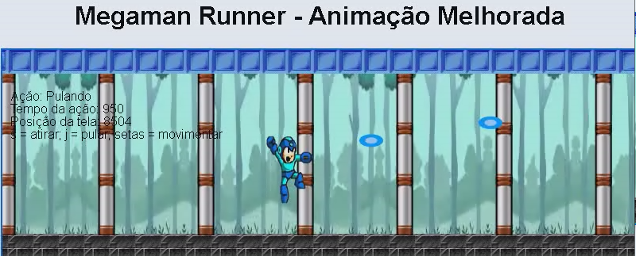

<!-- 
  Tags: Dev
  Label: 🎮 Projeto de jogo em JavaScript.
  Description: Descrição de um projeto de jogo baseado em JavaScript.
  path_hook: hookfigma.hook8
-->

# Jogo Simples em JavaScript

Este repositório contém um pequeno prototipo de jogo desenvolvido em JavaScript, que ilustra a lógica de programação e o uso de algoritmos para criar uma experiência de jogo interativa. O jogo envolve um personagem que pode se mover, pular e atirar, proporcionando uma base para entender os fundamentos do desenvolvimento de jogos.



## ✨ Funcionalidades

- **Movimentação do Personagem**: O personagem pode se mover para a esquerda e para a direita utilizando as setas do teclado.
- **Ações do Personagem**: Além de se movimentar, o jogador pode pular e atirar, cada ação com sua respectiva animação.
- **Animações**: Uso de sprites para representar diferentes ações do personagem (parado, andando, pulando, atirando).
- **Ambiente**: Fundo com uma floresta e elementos como chão e pilares, trazendo um contexto visual ao jogo.

## 🚀 Como testar

1. **Clone o Repositório**:
   ```bash
   git clone https://github.com/fabiuniz/game_javascript.git

## 👨‍💻 Author
[Fabiano Rocha/Fabiuniz]

## Licence

[MIT License]